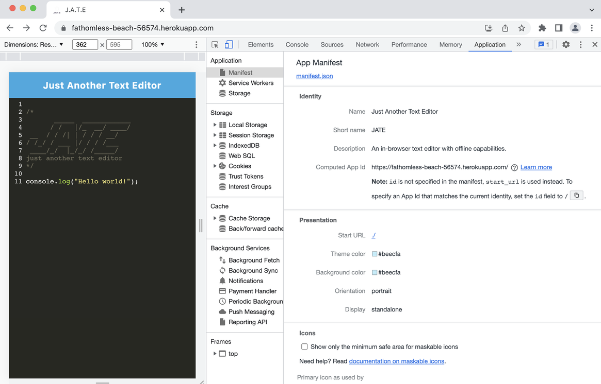
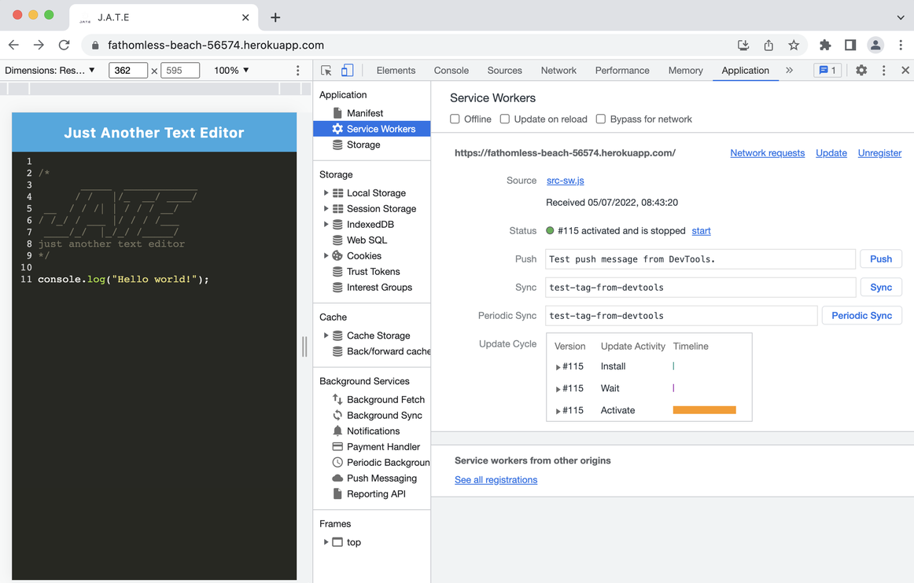
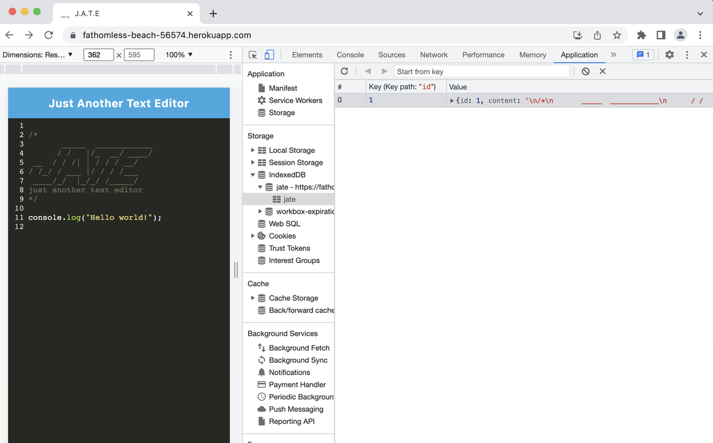

# J.A.T.E - Just Another Text Editor

An in-browser text editor that meets progressive web application (PWA) criteria. It utilises IndexedDB to store and retrieve data, along with webpack to assist with bundling code and allowing for page and image caching. This application also uses service workers to allow for offline capabilities so that your data persists, even if the internet is down!

- [Technologies](#technologies)
- [Installation](#installation)
- [Usage](#usage)
- [Live Demo](#live-demo)
- [Screenshots](#screenshots)
- [Resources](#resources)
- [License](#license)
- [Contact](#contact)

## Technologies

This application was built using the following technologies and languages:

- [Node.js](https://nodejs.org/en/)
- [Express.js](https://expressjs.com/)
- [Webpack](https://webpack.js.org/)
- [Workbox](https://developer.chrome.com/docs/workbox/)
- [IndexedDB and the idb package](https://www.npmjs.com/package/idb)
- [Babel](https://babeljs.io/)
- [Deployed on Heroku](https://fathomless-beach-56574.herokuapp.com/)
- JavaScript

## Installation

Since this application is [deployed on Heroku](https://fathomless-beach-56574.herokuapp.com/), there is an installation button to install the app from there, allowing you to use it completely offline.

If you want to install it the long way, you'll first need to clone the [text-editor repo on GitHub](https://github.com/jazzberriess/text-editor) or download the zipfile then install node.js, and other dependencies.

To install the dependencies included in this repo, navigate to the root directory of the cloned or downloaded repo. In either your terminal, command line or using the integrated terminal in your code editor of choice, enter the following command:

`npm i`

OR

`npm install`

If you're including the `package-lock.json` file from this repo in your own files, then run the following command instead:

`npm ci`

## Usage

To use the app, simply head on over to [the deployed app on Heroku](https://fathomless-beach-56574.herokuapp.com/) to get started! It's super straight forward; click in the text editor and start typing away.

## Live Demo

### Demo of the app being used online, installed and used offline.

## Screnshots

### Screenshot showing the manifest

### Screenshot showing the service worker

### Screenshot showing the IndexedDB database

## Resources

- [Webpack Documentation](https://webpack.js.org/guides/getting-started/)

- [Workbox Documentation](https://developer.chrome.com/docs/workbox/modules/workbox-recipes/)

- [MDN Docs](https://developer.mozilla.org/en-US/)

- [Google Chrome Developers - Cache your fonts, images and pages](https://youtu.be/utxTqssjp-o?t=155)

- [Stack Overflow: index html isn't displaying favicon](https://stackoverflow.com/questions/52024445/index-html-template-isnt-loading-favicon-for-htmlwebpackplugin/66761341#66761341)

- [Stack Overflow: how can I make Heroku install devDependencies](https://stackoverflow.com/questions/22954782/how-can-i-make-heroku-install-devdependencies)

## License

This project is covered under the [MIT license](https://github.com/jazzberriess/social-network-api/blob/main/LICENSE)

&copy; 2022 Christi Scappatura

## Contact

Contact [Christi on GitHub](https://github.com/jazzberriess)
